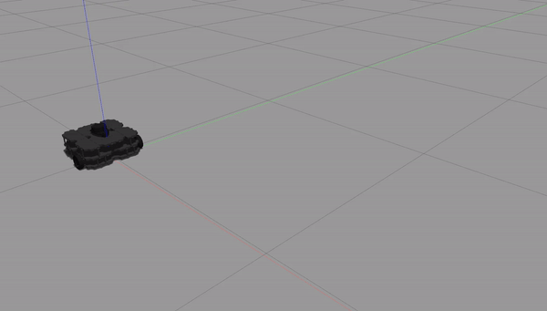
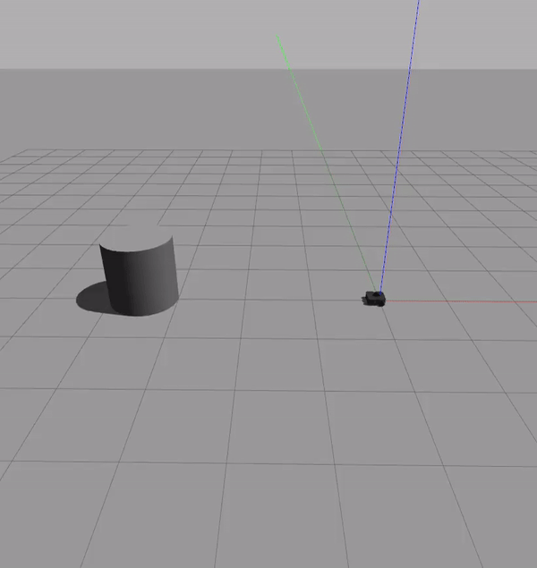

# warmup_project
## Behaviors
### Driving in a Square
* The goal of this behavior is to make the Turtlebot3 robot move forward and turn 90 degrees four times. My approach to accomplishing this was to write to commands (`move_forward` and `move_turn`) which would make the robot move a specified by distance/angle at a specified speed. These commands function by sending Twist messages to the `/cmd_vel` topic. Because Twist messages contain velocity information, each command also stops the robot momentarily at the end of the method in order to reset its linear and angular velocity to zero.
* The `__init__` method only initializes the node, initializes a publisher for the Twist message, and initializes a Twist message which can be used to reset the robot's velocity vectors to zero. Two methods, `move_forward` and `move_turn`, are used to send commands to the robot. Each works in roughly the same way: the method is called with a desired distance to move or angle to rotate to, and a speed for the linear/angular velocity. The start time is recorded, and while the current distance/angle of the robot is less than the distance/angle specific, a Twist message is sent containing the linear/angular velocity of the specified speed, and the current distance/angle is calculated based on the elapsed time. Once the desired distance/angle is reached, the stopping Twist message is sent, and `rospy.sleep()` is called so that the robot's velocity can be reset to zero. The `run` method calls `move_forward()` and `move_turn()` on a loop, such that four iterations of the loop cause the robot to move in a square.

### Person Follower
* The goal of this behavior is to make the robot follow the closest object up to a safe distance, and to retreat to a safe distance if it is too close to the closest object. To do this, I added the `get_scan` method to read the LiDAR from the /scan topic to get the closest object, the `get_angle` method to convert the angle in degrees to radians, and `get_speed` to determine the speed the robot should drive in order to safely avoid the closest object.
* The `__init__` method initializes the node, a publisher for Twist messages, a subscriber for LaserScan messages, variables for the distance and angle to the closest object, and some constants used to fine tune robot navigation. `get_scan` is a callback function for the LaserScan subscriber, which reads the topic to determine the angle which contains the closest distance reading, and saves this angle and distance. The median of the previous ten readings is use to reduce occasional noise (too low of a reading queue is too susceptible to noise, and too high of a reading is too slow to react to the environment). `get_angle` converts the angle reading in degrees to radians, where the front of the robot is 0, the back of the robot going CCW is pi, and the back of the robot going CW is -pi. `get_speed` will get a positive velocity if it is outside of the distance of the SAFE_DIST constant, which decreases to zero the closer the robot is to the safe zone. Otherwise, a negative velocity is returned, so that the robot can drive backwards into the safe zone. In a loop, `run` will:
  * Get the convert the currently saved angle reading.
  * If the robot is too close to the closest object  (inside of the safe zone), it will prioritize reversing out of the safe zone.
  * If the closest object isn't in the robot's deadzone (a field of view in front of the robot which is approximately 20 degrees), it will turn towards the object.
  * If the robot is outside of the safe zone and the object is within scanning range, it will drive towards the safe zone. Otherwise, the robot will do nothing.

### Wall Follower

## Challenges
Learning to control the robot's movement has been the most difficult aspect of this project. In the first behavior, I thought I could send turn/drive commands to the robot in a loop, but this was prone to innaccuracy of movement in the simulation, and was impossible to control in the middle of a command. When I implemented this in the second behavior, it was impossible to get the robot to follow the closest object consistently, so I realized that I needed to integrate the control functionality in the main loop of the node, instead of separating it out into a different method.
Dealing with noise from the LiDAR was also difficult in the second behavior. At first, I thought that my robot was moving erratically because of the difficulty in controlling it (which was part of the problem), but the robot kept reading the LiDAR such that it went in the wrong direction, sometimes even driiving outside of the range in which the scanner could find the closest object. Averaging the most recent values didn't work when there were any large outliers, but using the median seemed to work the best at mitigating the noise for now.

## Future Work
Getting the robot to drive in a straight line, or at least to move in a predictible manner such that I can accurately read the state of the robot at any time. Also, being able to get accurate LiDAR readings is something that needs to be worked on, because a handful of noisy readings has been able to knock the robot off course a few times in this project. Furthermore, making the robot drive smoothly will also be a challenge in the future, as I don't know if there is an "accepted way" to make the robot smoothly follow an object or path. I suspect this could just be down to reducing the driving speed, but it seems to be way too easy for the robot to swerve off-course, when I would expect that few environments in the real world have so little friction between the terrain and the wheels of the robot. I'd also like to improve the way that I read the LiDAR of the robot, because occasionally reading nothing as the "closest object" would take it far off-course. Maybe implementing probabilities for each potential degree direction instead of a definitive "this direction has the highest reading" is the way to fix this.

## Takeaways
* Given the course material so far, there seems to be a large deal of importance placed on being able to tell where the robot is when controlling it, which is something I had taken for granted.
* The logic of the robots seems to be simple when boiled down, but determining the action needed and specific velocities/sensitivities seems to require trial and error, until the solution becomes obvious.  
